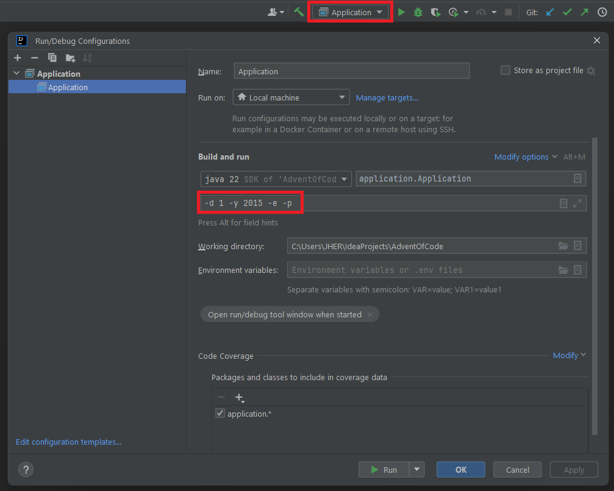

# AdventOfCode
All my answers IN JAVA for the exercises of the AdventOfCode event.

More information here : https://adventofcode.com/

## Installation & Run

### Installation
The project uses [JAVA 17 or more](https://jdk.java.net/archive/) and [Maven](https://maven.apache.org/download.cgi) to run.

### Run with parameters
To run the project, go to src/main/java/application and run the [Application.java](src/main/java/application/Application.java) class.

WARNING : this class must be run with parameters, as follows :

    -d (DAY) -y (YEAR) [-p] [-e] [-u]

    Explanations
    -d is for the day (mandatory). "-d 1" indicates the first day of the year.
    -y is for the year (mandatory). "-y 2015" indicates the year 2015.
    -p is for print (optional). If present, we want the result to be printed into the console.
    -e is for example (optional). If present, we want the exercise to run with the example input.
    -u is for URL (optional). If present, we want the application to fetch the input from the AdventOfCode website.

or you can use :

    -h

    Explanations
    -h is for help. This option overlap each other and list all the available arguments to launch the project.

These parameters are parsed in [AOCArguments.java](src/main/java/utilities/AOCArguments.java)

Here is the config you should use by default :

## Architecture
The project is split in three parts : the exercises, the tests and the resources.

### Exercises
The main/java folder contains 3 parts :

main/java/application : contains the main method to run the project.
 - It will create a new instance of AOCRunner using the parameters you used (see [Run with parameters](#run-with-parameters))

main/java/aoc : contains the exercises sorted by year / day.
 - WARNING : The application is path-dependant. The path to the exercises shall not be changed if you don't change it also in [AbstractAOC.java](src/main/java/utilities/AbstractAOC.java) (look at getAOCPath).

main/java/utilities : contains some useful classes to improve the use of the project.

### Tests
Unlike a "normal" java project, the tests are not there to test the application,
just to ensure the results are what we expect.

That can be useful if an update is made somewhere on the application,
and we want to ensure we still have the expected results.

WARNING : the tests are also path-dependant. They should be under the same path as the exercise it wants to test.

### Resources
The resources folder, at the root of the project, contains all the inputs of the exercises.

You have to fill them in order to launch an exercise.

Example : If you want to run the exercise 1 of 2015, you must fill the files
 - resources/example_input/year2015/day01.txt
 - resources/puzzle_input/year2015/day01.txt

NB : The puzzle_input can also be auto-filled if you fill the localSession file.
 - For this, you MUST place it under the resources directory ("resources/localSession", with no extension)
 - It will contain your authentication token to the AOC website.
 - When starting the application, you also must use the -u argument.